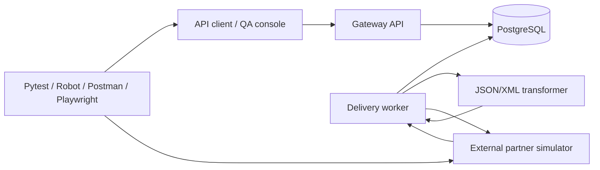

# RelayHub — Distributed Systems Quality Engineering Portfolio

RelayHub is a small, containerized message-relay platform built to demonstrate senior-level testing of networked and distributed software. The application is intentionally compact; the testing surface is not.

The repository covers manual and automated testing, JSON/XML interoperability, multi-service integration, retry and recovery behaviour, secure data handling, release evidence, and CI quality gates. All systems, organizations, users, and test data are fictional. No customer code, production data, or restricted material is included.

## What the project demonstrates

| Area | Evidence in this repository |
|---|---|
| Test analysis and planning | Risk-based strategy, master test plan, requirements, acceptance criteria, and traceability |
| Manual testing | Functional, integration, interoperability, regression, security, and release test cases |
| API and interface testing | Pytest, Robot Framework, Postman/Newman, JSON Schema, XML handling, negative tests |
| Distributed-system testing | Gateway, database-backed worker, transformer, partner simulator, PostgreSQL, Docker Compose |
| Automation design | Layered fast tests, service/component tests, end-to-end tests, Playwright UI smoke tests |
| Defect lifecycle | Sample defect reports with reproduction, severity, root cause, retest, and regression scope |
| CI/CD and configuration management | GitHub Actions, container build, GHCR release workflow, versioned configuration |
| Secure testing | Input limits, XML entity protection, secret filtering, log redaction, dependency and container scans |
| Test reporting | JUnit XML, coverage, Robot reports, container logs, release-readiness inputs |
| Agile delivery | Sprint test plan, Definition of Done, triage workflow, release checklist |

## System under test



A request is accepted by the gateway and stored as `QUEUED`. A separate worker claims it, calls the transformer, and sends the normalized message to the simulated external partner. Transient partner errors are retried; client-side rejections are not. Every state transition is auditable.

The partner simulator can return controlled response sequences such as `503, 503, 202`. That makes failure recovery repeatable instead of depending on random network problems.

## Repository layout

```text
app/                    RelayHub gateway, worker, transformer, and partner simulator
config/schemas/         JSON Schema and XSD interface definitions
docs/                   Test plans, cases, traceability, defects, runbooks, and reports
test-data/              Valid and invalid synthetic messages
tests/unit/             Isolated logic, persistence, and retry tests
tests/component/        In-process API/service tests
tests/contract/         OpenAPI and data-contract checks
tests/security/         Abuse cases and controlled-information handling checks
tests/integration/      Live multi-process or Docker end-to-end tests
tests/robot/            Release smoke pack in Robot Framework
tests/postman/          Postman collection and local environment
tests/ui/               Playwright dashboard smoke test
tests/performance/      Small k6 service-level smoke profile
scripts/                Setup, orchestration, validation, and report helpers
.github/workflows/      Fast, integration, UI, security, nightly, and release pipelines
```

## Quick start with Docker

Prerequisites: Git, Docker Desktop or Docker Engine with Compose, and Python 3.11 or newer.

### Windows

```bat
scripts\windows\setup.bat
scripts\windows\start-lab.bat
scripts\windows\run-tests.bat
```

Open the QA console at `http://127.0.0.1:8080` and the OpenAPI UI at `http://127.0.0.1:8080/docs`.

Stop the environment with:

```bat
scripts\windows\stop-lab.bat
```

### Linux or macOS

```bash
./scripts/setup.sh
. .venv/bin/activate
./scripts/start-lab.sh
./scripts/run-tests.sh
```

## Fast verification without Docker

The unit, component, contract, and security suites use SQLite and in-process HTTP clients:

```bash
python -m pytest -m "unit or component or contract or security" \
  --cov=app --cov-report=term-missing
```

A local multi-process end-to-end runner is also included. It starts the four Python processes on ports `18080`, `18082`, and `18083`, uses a temporary SQLite database, runs the integration pack, and shuts everything down:

```bash
python scripts/run_local_e2e.py
```

This runner is useful when Docker is unavailable. Docker Compose remains the production-like test environment because it uses PostgreSQL and isolated service processes.

## Verified baseline

The committed verification snapshot from 2 September 2026 records:

| Scope | Result |
|---|---:|
| Unit, component, contract, and security automation | 52 passed |
| Live multi-process integration | 5 passed |
| Branch-aware application coverage | 88.47% |

JUnit XML, coverage XML, service logs, environment details, and validation results are retained under [`evidence/local-verification/`](evidence/local-verification/README.md). Environment-specific Docker, Robot, Newman, browser, k6, and ZAP execution remains owned by the CI workflows.

## Individual test packs

```bash
# API/service automation
python -m pytest -m "unit or component or contract or security"

# Live multi-service integration
RUN_INTEGRATION=1 BASE_URL=http://127.0.0.1:8080 \
PARTNER_BASE_URL=http://127.0.0.1:8083 \
python -m pytest -m integration

# Robot Framework acceptance smoke
robot --outputdir artifacts/robot tests/robot

# Postman/Newman regression
newman run tests/postman/relayhub.postman_collection.json \
  -e tests/postman/relayhub.postman_environment.json

# Browser smoke
RUN_UI=1 BASE_URL=http://127.0.0.1:8080 python -m pytest -m ui
```

## Quality gates

The main CI workflow performs:

1. Repository structure and content validation.
2. Ruff linting and format checks.
3. Mypy static analysis.
4. Fast Pytest suites with branch coverage and JUnit output.
5. Bandit source scanning and dependency audit checks.
6. Trivy scanning of the built application image.
7. Docker-based integration, Robot, and Newman execution.
8. Playwright UI smoke execution.
9. Evidence upload even when a test job fails.

A scheduled workflow adds k6 service smoke and OWASP ZAP baseline checks. Tagged releases build the shared application image and publish it to GitHub Container Registry.

## Test design notes

- Automation is split by feedback speed. A failed field validator should be found by a unit or component test, not by a browser test eight minutes later.
- Message IDs are protected by both application behaviour and a database uniqueness constraint. The second layer matters under concurrent submission.
- The list API does not expose raw payloads. Detailed payload verification is performed at the controlled partner simulator.
- The worker retries transient failures only. A partner `400` is treated as a deterministic rejection and is not retried.
- Logs carry message and correlation IDs, but known secret fields are redacted.
- Test data is synthetic and may be committed safely.

## Documentation starting points

- [Requirements and acceptance criteria](docs/requirements.md)
- [Architecture and interface boundaries](docs/architecture.md)
- [Test strategy](docs/test-strategy.md)
- [Master test plan](docs/master-test-plan.md)
- [Requirements traceability](docs/traceability.md)
- [Environment runbook](docs/operations/environment-runbook.md)
- [Defect triage guide](docs/operations/defect-triage.md)
- [Release readiness assessment](docs/reports/release-readiness.md)

## Deliberate limits

This is a test portfolio, not a claim that the sample platform is production-ready. Current limits and follow-up ideas are recorded in [KNOWN_LIMITATIONS.md](KNOWN_LIMITATIONS.md). Keeping those visible is more useful than pretending the lab covers every possible failure mode.

## License

MIT. See [LICENSE](LICENSE).
# QA-system-Portfolio

